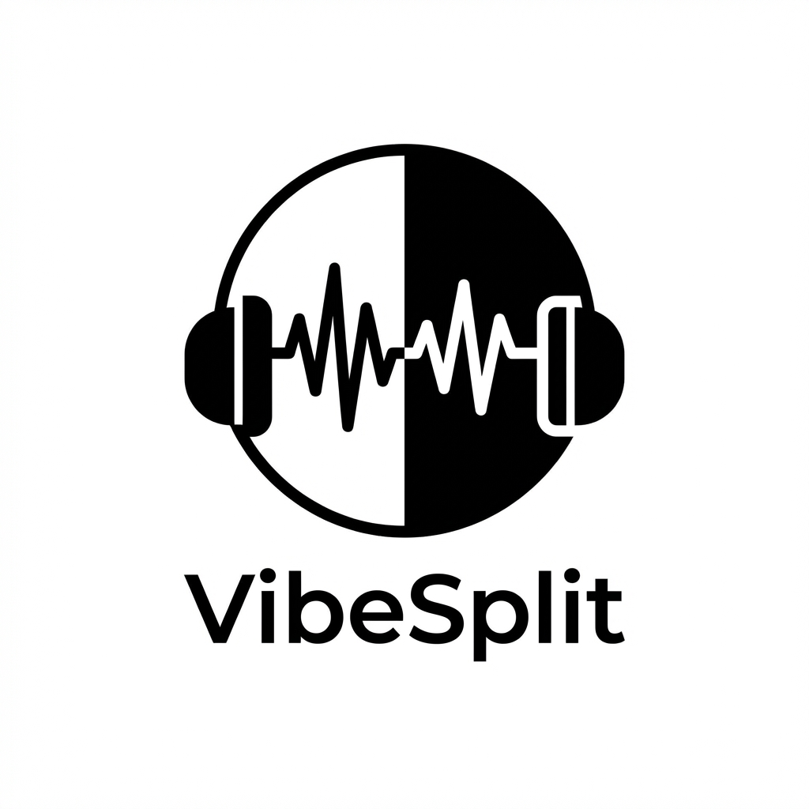

# VibeSplit 🎧
**The Ultimate Dual Audio Music Player for Android**



## 🚀 Overview
**VibeSplit** transforms your Android device into a dual-channel audio station. By intelligently manipulating stereo channels, it allows you to play **two different songs simultaneously** on a single pair of Bluetooth TWS (True Wireless Stereo) earbuds. 

One earbud plays your vibe, the other plays theirs. No more fighting over the aux cord!

## ✨ Key Features

### 🔀 Split Mode (Dual Audio)
- **Independent Playback**: Load distinct tracks for Player A (Left) and Player B (Right).
- **Channel Isolation**: Audio Engine routes Song A purely to the Left channel and Song B to the Right.
- **Individual Controls**: Separate Volume, Play/Pause, Seek, Shuffle, and Repeat controls for each listener.

### 🔊 Stereo Mode (Shared Vibe)
- **High Fidelity**: Switch to standard mode to enjoy music in full stereo quality.
- **Seamless Merge**: Instantly merge both players into one with a simple toggle.

### 🎨 Modern Glassmorphism UI
- **Premium Aesthetics**: Features a dark, sleek design with glass-like transparency, gradients, and blurs.
- **Dynamic Visuals**: Spinning vinyl animations, neon progress rings, and simulated sound waves.
- **Fluid Animations**: Smooth transitions between Split/Stereo modes and channel swapping.

### 🛠 Power User Tools
- **Custom Library Management**: Bypass Android's restrictive scanning with a built-in **Secure Folder Picker** (Android 11+ supported).
- **Mini Player**: Persistent playback controls at the bottom of the library.
- **Smart Notifications**: Rich media notification showing status for both players.
- **Channel Swap**: Instantly swap music between left and right ears with one tap.

## 📱 Tech Stack
- **Language**: Kotlin
- **Architecture**: MVVM-adjacent (Activity + Repository + Service)
- **UI Toolkit**: Android XML Views (ConstraintLayout, FrameLayout) & Custom Drawables
- **Audio Engine**: Low-level `AudioTrack` API for raw PCM manipulation and channel interleaving.
- **Persistance**: `MediaStore` & `DocumentFile` API.

## 🛠️ Build Instructions

### Prerequisites
- Android Studio Iguana or later
- JDK 17+
- Android Device (Physical device recommended for Bluetooth testing)

### Steps
1. **Clone the Repository**
   ```bash
   git clone https://github.com/yourusername/VibeSplit.git
   ```
2. **Open in Android Studio**
   - Point to the root directory.
   - Wait for Gradle Sync to complete.
3. **Build & Run**
   - Select `app` configuration.
   - Click **Run** (Green Play Button).
   - **Note**: Grant "All Files Access" permission when prompted to load music from custom folders.

## 🤝 Contributing
Contributions are welcome! Please fork the repository and submit a pull request with your improvements.

## 📜 License
This project is licensed under the MIT License - see the [LICENSE](LICENSE) file for details.

---
*Built with ❤️ by Gaurav Sharma*
